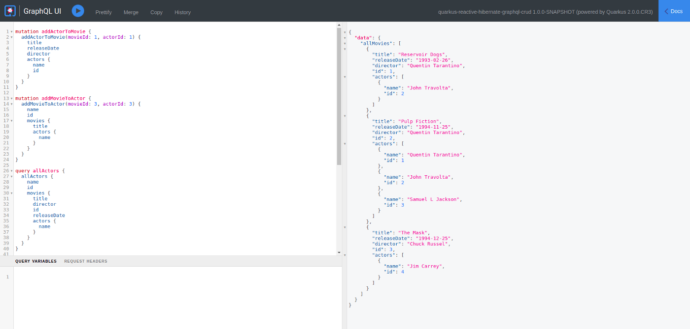

# Quarkus CRUD with GraphQL

### Description
A CRUD app with Quarkus, Reactive Hibernate, Panache and GraphQL using a PostgreSQL database.


### Tech Stack
- Quarkus (JDK 11)
- GraphQL
- PostgreSQL

### Setup & Launch

#### Launch PostgreSQL Database
```
docker run -d --rm --name my_reactive_db -e POSTGRES_USER=user -e POSTGRES_PASSWORD=password -e POSTGRES_DB=my_db -p 5433:5432 postgres:10.5
```

#### Launch Quarkus Application
`./mvnw compile quarkus:dev`

#### GraphQL Generated Schema
http://localhost:8080/graphql/schema.graphql

#### Quarkus GraphQL UI
http://localhost:8080/q/graphql-ui/ 

Navigate to the above URL and add the following queries to interact:

```
mutation addActorToMovie {
  addActorToMovie(movieId: 1, actorId: 1) {
    title
    releaseDate
    director
    actors {
      name
      id
    }
  }
}
mutation addMovieToActor {
  addMovieToActor(movieId: 3, actorId: 3) {
    name
    id
    movies {
      title
      actors {
        name
      }
    }
  }
}
query allActors {
  allActors {
    name
    id
    movies {
      title
      director
      id
      releaseDate
      actors {
        name
      }
    }
  }
}
query allMovies {
  allMovies {
    title
    releaseDate
    director
    id
    actors {
      name
      id
    }
  }
}
mutation deleteMovie {
  deleteMovie(movieId: 2)
}
mutation updateMovie {
  updateMovie(movieId: 1, movie: {title: "rEsErvOiR d0Gs"}) {
    title
  }
}
```



<br />

#### Acknowledgments
- Based on the Medium article ['Creating a CRUD app with Quarkus, Reactive Hibernate, Panache and GraphQL using a PostgreSQL database'](https://medium.com/geekculture/creating-a-crud-app-with-quarkus-reactive-hibernate-panache-and-graphql-using-a-postgresql-216ecd75ee52)

- [Article's GitHub Repo](https://github.com/dvddhln/quarkus-reactive-hibernate-graphql-crud)